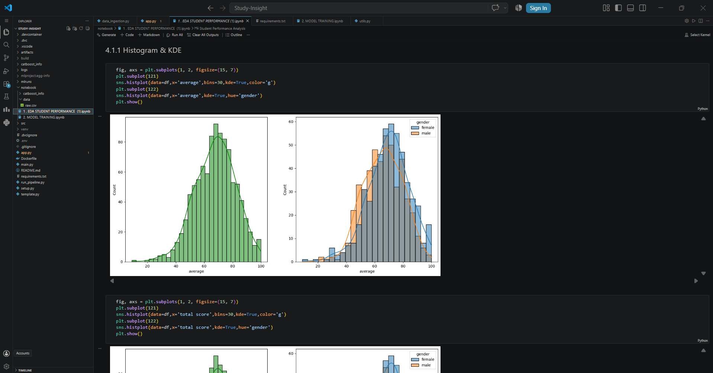
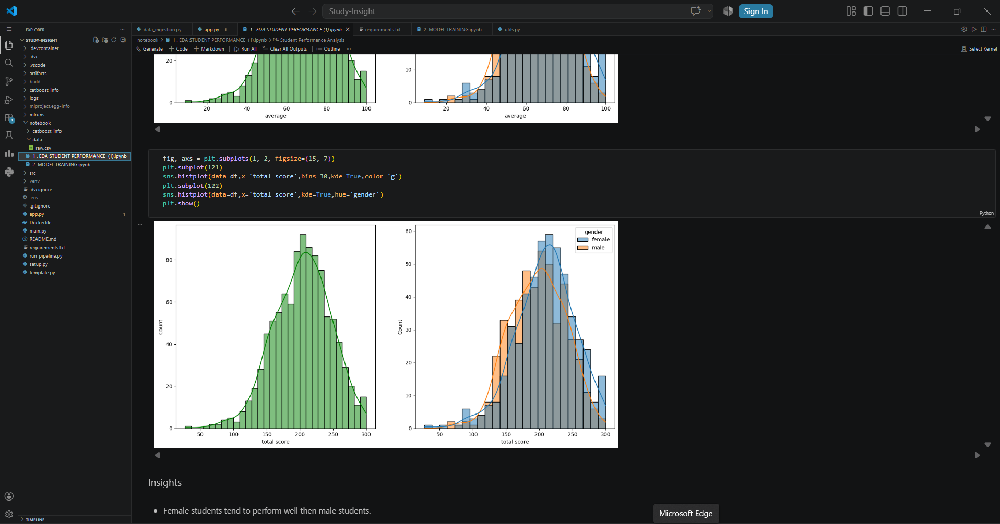
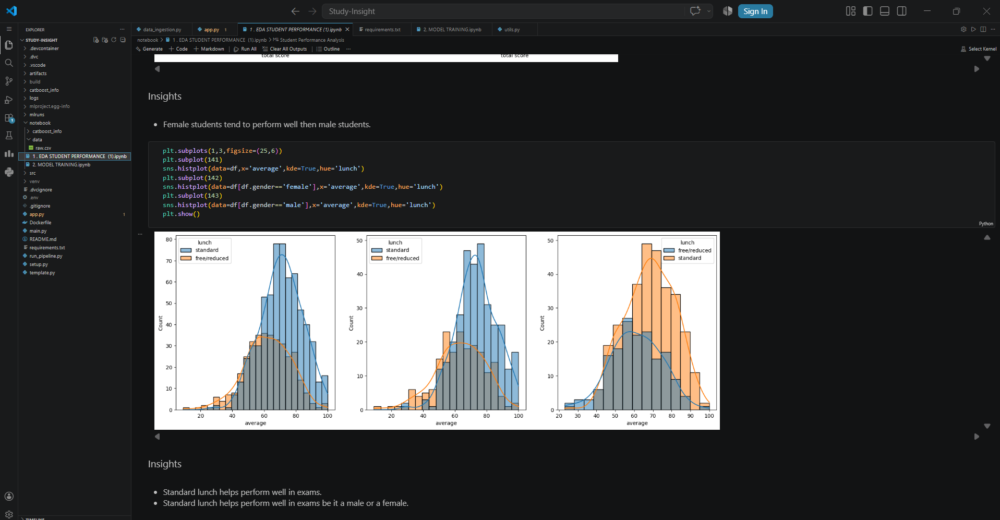
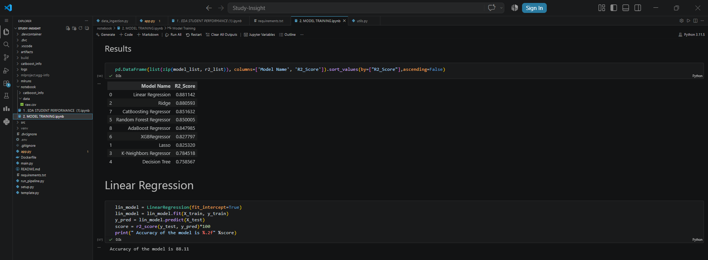
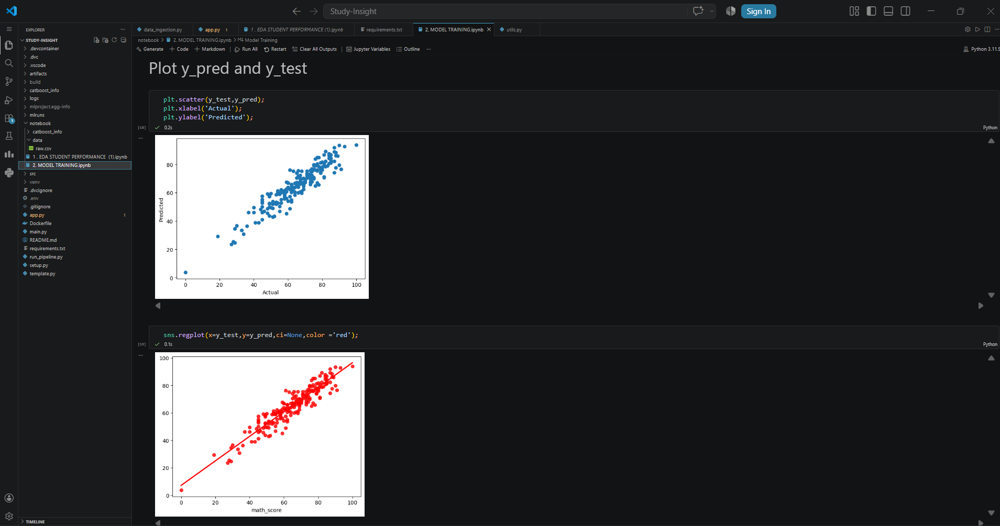

# 📊 Study-Insight: Student Performance Analytics Platform

## 📌 Overview & Problem Statement
**Study-Insight** is an end-to-end machine learning application designed to analyze and predict student academic performance based on demographic, socio-economic, and educational variables. 

Educational outcomes are heavily influenced by external factors. The goal of this project is to build a robust predictive pipeline that not only estimates a student's potential math score but also provides **actionable, data-driven advice** (e.g., the statistical impact of test preparation courses or nutritional changes) to help students and educators maximize academic potential.

---

## 🚀 Live Cloud Dashboard
The model is deployed as a highly interactive, custom-styled web application on Streamlit Community Cloud. 

### 1. Prediction & Insights Panel
Users can input student parameters to receive a real-time predicted math score, estimated class rank, global percentile, and actionable advice based on historical data trends.

### 2. Interactive Model Analytics
To ensure machine learning transparency, the app features a diagnostics tab visualizing the model's actual vs. predicted performance across 1,000 test data points, complete with a dynamic residual error color scale.

---

## 🧠 Approach & Implementation

### Phase 1: Exploratory Data Analysis (EDA)
Extensive statistical analysis and data visualization were conducted to uncover hidden patterns in the dataset before modeling. 

**Key Insights Discovered:**
* **Gender Disparities:** Analysis of average and total scores revealed distinct distribution curves between male and female students, with female students generally performing better in overall averages.

* **Socio-Economic Impact (Nutrition):** Standard lunch programs showed a strong positive correlation with higher exam performance across all demographics compared to free/reduced lunch programs.

### Phase 2: Model Training & Evaluation
Multiple regression algorithms were tested to find the optimal fit for the data. The models were evaluated based on their $R^2$ Score and Mean Absolute Error (MAE).

**Model Leaderboard:**
1. **Linear Regression (Winner): 88.11%**
2. Ridge Regression: 88.05%
3. CatBoost Regressor: 85.16%
4. Random Forest: 85.00%
5. XGBoost: 82.77%

*Linear Regression outperformed complex ensemble methods, proving that a well-processed dataset with linear relationships benefits from simpler, highly interpretable models.*

*Residual tracking and regression line plotting confirmed the model's high accuracy and tight variance.*

### Phase 3: MLOps & Experiment Tracking
To maintain production-level standards, **MLflow** (via DagsHub) was integrated into the training pipeline to track parameters, log metrics, and version control the registered models.

---

## 🛠️ Technologies Used
* **Languages:** Python (Pandas, NumPy)
* **Machine Learning:** Scikit-Learn, CatBoost, XGBoost
* **Data Visualization:** Matplotlib, Seaborn, Plotly Express
* **MLOps / Tracking:** MLflow, DagsHub
* **Deployment:** Streamlit Community Cloud, Git/GitHub

---

## 📞 Connect with the Developer
* **LinkedIn:** [https://www.linkedin.com/in/rahulkumarsrivastava/]
* **Email:** [rahulkumarsrivastava90@gmail.com]

*If you found this project interesting, feel free to star ⭐ the repository!*